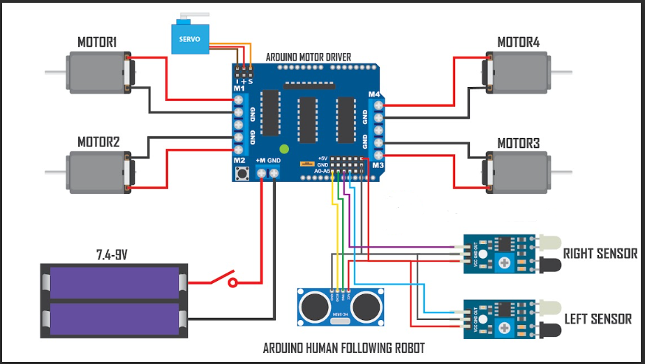

# IoT Human – Following Car

## Introduction
Welcome to the **IoT Human – Following Car** project! This innovative project features an IoT-powered car that autonomously tracks and follows humans. By integrating advanced components and intelligent programming, this project exemplifies my ability to blend robotics and IoT seamlessly.

### Tech Synergy
This project showcases the synergy between robotics and IoT, creating a dynamic fusion of hardware and software. It highlights my capacity to synthesize diverse technologies into a cohesive system.

### Precision Tracking
Equipped with an Arduino Uno, a motor driver shield, and a servo motor, the car achieves exceptional accuracy in autonomously following human movement.

### Sensory Intelligence
The integration of ultrasonic and infrared sensors allows the car to detect obstacles, measure distances, and navigate complex environments with precision.

### Real-World Application
Beyond its technical prowess, this project demonstrates the practical applications of IoT-driven robotics in areas such as surveillance, assistance, and automation, making it a notable addition to my project portfolio.

## Components and Their Functions
- ***`Arduino Uno`***: The central processing unit of the project, responsible for interpreting sensor inputs and controlling motor outputs. Its versatility and ease of programming make it ideal for managing the car's operations.
- ***`Motor Driver Shield`***: Facilitates control of multiple motors by interfacing between the Arduino and TT gear motors, allowing precise speed and direction control for smooth movement.
- ***`Wheels and TT Gear Motors`***: Four wheels and TT gear motors provide mobility, enabling the car to make intricate turns while following a human.
- ***`Servo Motor`***: Manages steering control, allowing the car to autonomously adjust its direction based on sensor inputs to stay aligned with the human it follows.
- ***`Ultrasonic Sensor`***: Measures the distance between the car and the human, crucial for avoiding collisions and maintaining a safe following distance.
- ***`Infrared Sensor`***: Detects obstacles in the car's path, enabling it to navigate around objects and ensure smooth movement in complex environments.
- ***`18650 Li-ion Battery and Battery Holder`***: Powers the car, providing extended operation periods with rechargeable batteries for sustainability.
- ***`Male and Female Jumper Wires`***: Establish connections between components, ensuring reliable communication and functionality.
- ***`Acrylic Sheet`***: Serves as the car's chassis, providing structural support and a secure platform for mounting components.
- ***`DC Power Switch`***: Allows convenient control over the car's power supply, enhancing user experience and energy efficiency.

## Circuit Diagram
Below is the circuit diagram for the `IoT Human – Following Car` project:

## Code
The code for this project is available in the `main` directory. It includes all the necessary files for controlling the car, processing sensor data, and managing movement.

Feel free to explore the repository to learn more about the project and its implementation. Contributions and feedback are welcome!

## Contact
For any questions or inquiries, please reach out to [zeelvc7@gmail.com](mailto:your-email@example.com).
